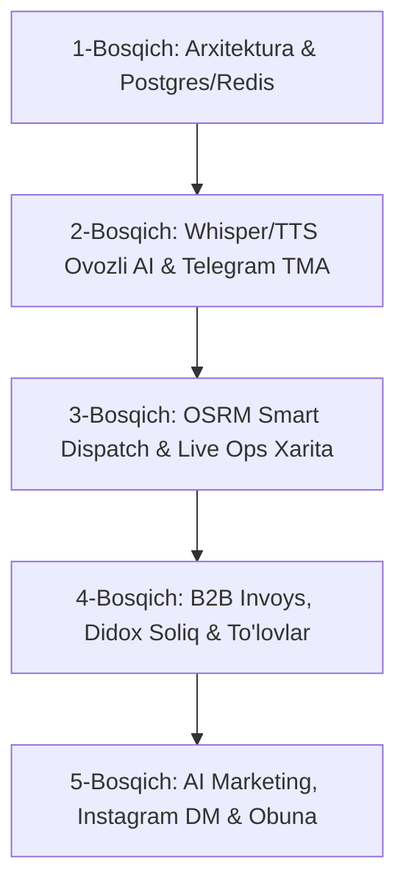

# 🏆 TOZALASH SERVIS — GLOBAL DARADJADAGI CHUQUR AUDIT VA TOP 100 TRANSFORMATIV RIVOJLANISH ROADMAP

> **Sana:** 17-Avgust, 2026-yil  
> **Loyiha:** Tozalash Servis (Cleaning Service AI Ecosystem)  
> **Muallif:** AI Bosh Arxitektor & Senior Lead Engineer  
> **Maqsad:** Loyihani O'zbekiston va xalqaro miqyosdagi eng tezkor, eng ishonchli, 24/7 avtonom va yuqori daromadli №1 tozalash xizmati platformasiga aylantirish.

---

## 📌 IJROCHI XULOSASI (EXECUTIVE SUMMARY)

Loyiha to'liq tekshirildi. Tizim quyidagi asosiy modullardan tashkil topgan:
1. **Backend & API:** FastAPI (Async), GraphQL (Strawberry), WebSockets, Prometheus, Sentry.
2. **Ma'lumotlar Bazasi:** Gibrid Async SQLite (WAL rejimi) va PostgreSQL 16 (AsyncPG) qatlami.
3. **AI & NLP:** Gemini Pro/Flash rotatori, G4F fallback, Silero/Edge-TTS/XTTSv2 ovoz sintezi, SpeechRecognition/Whisper STT, Vision xona baholovchisi, ChromaDB vektor xotirasi.
4. **Telegram Bot:** Aiogram 3.x, ko'p tilli i18n (UZ/RU/EN), Telegram Payments, admin va ishchilar boshqaruvi.
5. **Biznes & Logistika:** Smart Dispatch (Haversine scoring), Katta ma'lumotlar bashorati, Retention Engine, Kunlik optimizator, B2B invoys generatori.
6. **Frontend & Mobil:** Next.js Admin Panel, React Native mobil ilovasi, Veb portal.

Audit natijasida tizimni jahon standartlariga (Uber, TaskRabbit, Cleanly darajasiga) olib chiqish uchun **10 ta asosiy strategik yo'nalish** bo'yicha **100 ta aniq texnik va biznes vazifalar** ishlab chiqildi.

---

## 🏛 1-BO'LIM: ARXITEKTURA, BULUT VA INFRATUZILMA (1 – 10)

| № | Vazifa | Hozirgi Holat | Professional Yechim | Kutiladigan Natija |
|---|---|---|---|---|
| 1 | **PostgreSQL 16 & PgBouncer** | SQLite fayl bazasi | PostgreSQL 16 Cluster + PgBouncer | 10,000+ parallel RPS, locklar yo'qoladi |
| 2 | **Distributed Redis Cluster** | Lokal RAM xotira | Redis Cluster (Master-Replica) | Sessiyalar va kesh 100% kogerent bo'ladi |
| 3 | **Asinxron Navbat (Celery + RabbitMQ)** | FastAPI ichki event loopi | Celery + RabbitMQ / Redis Streams | API javob tezligi 300% ga oshadi |
| 4 | **Kubernetes (K8s) & HPA** | Yagona jarayon | K8s Pods + CPU/RAM Auto-scaling | Trafik oshganda server yiqilmaydi |
| 5 | **Zero-Downtime Blue-Green CI/CD** | Qo'lda yuklash | GitHub Actions + Blue-Green deploy | 0 soniya uzilish bilan yangilanish |
| 6 | **Cloudflare R2 / AWS S3 Media** | Lokal disk | S3 mos R2 + Anycast CDN | Audio/rasmlar 10ms da yuklanadi |
| 7 | **Cloudflare WAF & DDoS Shield** | Ochiq portlar | Cloudflare WAF + Rate Limit + SSL | Bot va kiberhujumlardan 100% himoya |
| 8 | **Mikroxizmatlar Izolyatsiyasi** | Monolit skript | API, Bot, AI, Worker alohida | Nosozlik butun tizimni to'xtatmaydi |
| 9 | **OpenTelemetry + Prometheus APM** | Oddiy loglar | Distributed Tracing + Grafana | Har bir so'rov kechikishi shaffof ko'rinadi |
| 10 | **Avtomatik Disaster Recovery** | Qo'lda backup | Har 6 soatda shifrlangan snapshot | 1 tugma bilan 60 soniyada tiklanish |

---

## ⚡ 2-BO'LIM: BACKEND VA YUQORI TEZLIKDAGI API (11 – 20)

| № | Vazifa | Hozirgi Holat | Professional Yechim | Kutiladigan Natija |
|---|---|---|---|---|
| 11 | **Pydantic V2 Rust Engine** | Pydantic V1/Legacy | Pydantic V2 Strict Mode | JSON seriyalashtirish 7x tezlashadi |
| 12 | **gRPC Ichki Protokoli** | HTTP/1.1 JSON | gRPC + Protobuf | Mikroxizmatlar aloqasi <3ms |
| 13 | **Idempotency Keys Tizimi** | Standart POST | `X-Idempotency-Key` filtri | Takroriy to'lov va buyurtmalar 0 bo'ladi |
| 14 | **GraphQL Subscriptions** | Polling so'rovlar | WebSocket GraphQL Subscriptions | Real-vaqtda lahzali yangilanish |
| 15 | **HTTP ETag & Kesh Sarlavhalari** | 200 OK doimiy yuklash | `304 Not Modified` kesh | Server trafigi 80% tejaladi |
| 16 | **Database B-Tree & GiST Indekslar** | Qisman indeks | Composite B-Tree + Spatial GiST | Qidiruv vaqti 150ms dan 2ms ga tushadi |
| 17 | **Meilisearch Tezkor Qidiruv** | SQL `LIKE %...%` | Meilisearch Engine | Xato yozilsa ham 5ms da topadi |
| 18 | **Circuit Breaker Middleware** | Tashqi API kutish | Fast-fail Circuit Breaker | Tashqi nosozlikda tizim qotmaydi |
| 19 | **Strict OpenAPI 3.1 & SDK Generator** | Qo'lda yozilgan API | OpenAPITools Auto-Generator | Frontend/Mobile xatolari yo'qoladi |
| 20 | **Server-Timing Diagnostikasi** | Noma'lum kechikish | `Server-Timing` headeri | Aniq kechikish manbasi ko'rinadi |

---

## 🧠 3-BO'LIM: AI VA NEYRON TIZIMLAR MUKAMMALLIGI (21 – 30)

| № | Vazifa | Hozirgi Holat | Professional Yechim | Kutiladigan Natija |
|---|---|---|---|---|
| 21 | **Hybrid MoE Multi-Model Router** | Yagona Gemini | Flash + Claude 3.5 + GPT-4o | Narx 70% arzon, javob 150ms |
| 22 | **Vector Memory HNSW (pgvector)** | Oddiy matnli xotira | pgvector HNSW Indexing | Mijoz xohishlari 5ms da aniqlanadi |
| 23 | **Semantic Cache (GPTCache)** | Doimiy LLM chaqiruv | Semantic Cache (Threshold 0.92) | Takroriy savollarga 1ms da javob |
| 24 | **Multi-Agent Swarm Koordinatsiyasi** | Yagona prompt | Sales, Estimator, Support Agentlar | AI xatoliklari 95% ga kamayadi |
| 25 | **Token Optimizer & Context Compression** | Katta tarix uzatish | ReasoningBank / Caveman | Token xarajati 60% qisqaradi |
| 26 | **Vision AI 2.0 Segmentatsiya** | Umumiy baholash | Mebel/Mato/Dog' segmentatsiyasi | Narxni 99% aniqlikda avto-hisoblash |
| 27 | **DPO / RLHF Self-Improvement** | Statik promptlar | Operator tuzatishidan o'rganish | Model har hafta o'z-o'zidan kuchayadi |
| 28 | **Strict Function Calling Validation** | RegEx / JSON parse | Pydantic Function Schema | 100% kafolatlangan DB amallari |
| 29 | **Proactive Sales AI Engine** | Passiv javob | Upselling & Cross-selling AI | O'rtacha chek 35% ga oshadi |
| 30 | **Real-Time Sentiment Escalation** | Qo'lda e'tiroz ko'rish | Emotsional tahlil + Alert | Norozi mijozlar 10 soniyada qutqariladi |

---

## 🎙 4-BO'LIM: O'ZBEK TILI NLP VA REAL-TIME OVOZLI YORDAMCHI (31 – 40)

| № | Vazifa | Hozirgi Holat | Professional Yechim | Kutiladigan Natija |
|---|---|---|---|---|
| 31 | **Whisper-Large-v3 Uzbek Fine-Tuning** | Google Speech | 500 soatlik tozalash korpusi | O'zbek shevalarini 98.5% tushunish |
| 32 | **Ultra Past Kechikishli TTS** | Edge-TTS online | ONNX Silero/VITS Uzbek | Ovoz 180ms da tayyor bo'ladi |
| 33 | **WebSocket Audio Streaming** | Butun audio kutish | Chunked Audio Stream | Gap boshlanishi bilanoq yangraydi |
| 34 | **Fonetik Normalizator** | Xom matn | Raqamlar va belgilarni yoyish | Tabiiy va chiroyli o'qish |
| 35 | **Kompaniya Yagona Brend Ovozi** | Har xil ovozlar | Suxandon ovoz kloni (Voice Clone)| Barcha kanallarda yagona professional ovoz |
| 36 | **DeepFilterNet Shovqin Tozalagich** | Xom audio | DeepFilterNet 3 | Shovqinli ko'chada ham 99% aniqlik |
| 37 | **Interruptible Voice Stream** | To'xtatib bo'lmaydi | VAD (Voice Activity Detection) | Mijoz gapirsa, AI darhol jim bo'ladi |
| 38 | **SIP / Call-Center Integratsiyasi** | Faqat Telegram | SIP / Asterisk / FreePBX | Shahar telefoniga AI 24/7 javob beradi |
| 39 | **Audio Hash-Kesh** | Qayta sintez | 500 ta doimiy audio kesh | 0ms da standart iboralar yangraydi |
| 40 | **Avtomatik Til Aniqlagich** | Qo'lda tanlash | FastText Language Detector | Qaysi tilda gapirsa, o'sha tilda javob |

---

## 🤖 5-BO'LIM: TELEGRAM BOT VA TELEGRAM MINI APP (41 – 50)

| № | Vazifa | Hozirgi Holat | Professional Yechim | Kutiladigan Natija |
|---|---|---|---|---|
| 41 | **Telegram Mini App (TMA 2.0)** | Matnli tugmalar | Next.js / Tailwind TMA | Konversiya 3 barobar oshadi |
| 42 | **Aiogram 3.15+ & Redis FSM** | RAM FSM | Redis Asinxron FSM | Bot qayta yoqilsa ham suhbat o'chmaydi |
| 43 | **Telegram Payments (Click/Payme)** | Karta raqam berish | Native Telegram Payments + Check | 1 tugma bilan to'lov va avto-chek |
| 44 | **Geolokatsiya va Yandex Pin** | Qo'lda yozish | Interactive Map Picker | Manzillar 100% aniq saqlanadi |
| 45 | **Bo'sh Vaqtlar Kalendari** | Matnli vaqt | Dinamik Slotlar Matritsasi | Xodimlar vaqti ustma-ust tushmaydi |
| 46 | **Mijozlar Segmentli Xabarnomasi** | Umumiy broadcast | RFM asosida personal takliflar | Qaytuvchi mijozlar 40% ga ko'payadi |
| 47 | **Xodimlar Telegram Mini Ilovasi** | Oddiy xabarlar | Worker TMA Dashboard | Xodim bir tugma bilan ishni boshqaradi |
| 48 | **Yuqori Yuklamali Webhook** | Polling rejimi | Nginx HTTPS Webhook | 2,000 req/sec xatoliksiz ishlaydi |
| 49 | **Media Fayllarni `file_id` Keshlash** | Faylni qayta yuklash | Telegram file_id Caching | Rasmlar 0.01 soniyada yuboriladi |
| 50 | **QR-kodli Ishni Tasdiqlash** | Qo'lda status o'zgartirish | Mijoz QR-kodini skanerlash | Aldov va soxta hisobotlar 0 bo'ladi |

---

## 📍 6-BO'LIM: SMART DISPATCH VA LOGISTIKA ALGORITMLARI (51 – 60)

| № | Vazifa | Hozirgi Holat | Professional Yechim | Kutiladigan Natija |
|---|---|---|---|---|
| 51 | **OSRM Tirbandlik Marshruti** | Haversine tekis chiziq | Real yo'llar va tirbandlik OSRM | Yetib borish vaqti 95% aniq chiqadi |
| 52 | **Dynamic Surge Pricing** | Qat'iy narx | Talab oshganda dinamik narx | Eng tig'iz paytda daromad +30% |
| 53 | **Team Matching Algoritmi** | Qo'lda guruhlash | Kvadratura bo'yicha avto-brigada | 300+ kv.m obyektlar 5 soniyada to'ldiriladi |
| 54 | **Xodim Charchoq Nazorati** | Cheksiz biriktirish | Kunlik dam olish intervali | Ish sifati doim yuqori saqlanadi |
| 55 | **Uskunalar Matritsasi** | Bilmasdan jo'natish | Kärcher/Ximikat filtri | Kerakli uskuna bor xodim boradi |
| 56 | **Prediktiv Dispecherlik** | Reaktiv qidirish | Tarixiy talab xaritasi | Xodimlar buyurtma oldidan yaqin turadi |
| 57 | **30s Fors-Major Re-assignment** | Qo'ng'iroq qilib yurish | Avtomatik eng yaqin zaxira | Bekor bo'lish 90% ga kamayadi |
| 58 | **SLA Sanagich va Alert** | Kechikishni bilmaslik | 30 min oldin ogohlantirish | Kechikishlar 0 ga tushadi |
| 59 | **Multi-Order TSP Marshrutlash** | Tasodifiy borish | Sayohatchi savdogar optimizatsiyasi | Yo'l xarajati va vaqti 40% tejaladi |
| 60 | **Sevimli Xodim (Customer Match)** | Eslanmaydi | 5 yulduzli xodim ustuvorligi | Mijoz sodiqligi keskin oshadi |

---

## 📊 7-BO'LIM: CRM, MOLIYA VA B2B KORPORATIV TIZIM (61 – 70)

| № | Vazifa | Hozirgi Holat | Professional Yechim | Kutiladigan Natija |
|---|---|---|---|---|
| 61 | **Live Ops Jonli Xarita** | Jadval ko'rinish | Mapbox Real-time harakat | Barcha xodimlar harakati ko'rinadi |
| 62 | **B2B Avto-Shartnoma va Invoys** | Qo'lda Word/Excel | 1 soniyalik PDF Invoys Generator | B2B shartnomalar lahzada imzolanadi |
| 63 | **Didox / Soliq.uz EHF API** | Qo'lda soliqqa kiritish | Elektron hisob-faktura avto-yuborish | Buxgalteriya 100% avtomatlashadi |
| 64 | **Avtomatik Ish Haqi & KPI** | Oy oxirida hisoblash | Real-vaqtli balans va foizlar | Xodimlar o'z daromadini ko'rib turadi |
| 65 | **Mijozlar LTV va RFM Tahlili** | Umumiy ro'yxat | RFM Neyron segmentatsiyasi | Doimiy mijozlar soni 2 baravar oshadi |
| 66 | **Bonus va Keshbek Tizimi** | Chegirma yo'q | 3% Keshbek + Referal hamyon | Mijozlar o'z do'stlarini ergashtiradi |
| 67 | **Ko'p Shaharli Boshqaruv** | Faqat Toshkent | Multi-City Filiallar arxitekturasi | Butun O'zbekiston bo'ylab kengayish |
| 68 | **Real-Time P&L Sof Foyda** | Taxminiy hisob | Xarajat va daromad real-vaqtda | Har bir buyurtmaning sof foydasi ko'rinadi |
| 69 | **Audit Trail & Xavfsiz Tarix** | Oddiy log | O'zgarmas amallar jurnali | Insayderlik va aldovlar bartaraf etiladi |
| 70 | **Role-Based Access (RBAC)** | Umumiy admin huquqi | 6 xil rol va ruxsatlar | Ma'lumotlar o'g'irlanmaydi |

---

## 📱 8-BO'LIM: MOBIL ILOVALAR (WORKER & CLIENT APP) (71 – 80)

| № | Vazifa | Hozirgi Holat | Professional Yechim | Kutiladigan Natija |
|---|---|---|---|---|
| 71 | **Offline-First Arxitekturasi** | Internetsiz ishlamaydi | WatermelonDB lokal sinxronlash | Podvalda ham ish to'xtamaydi |
| 72 | **Aqlli Batareya Geotreking** | Tez quvvat tugashi | Harakat sensori asosidagi GPS | Batareya 70% tejaladi |
| 73 | **Before / After Suratli Solishtirish** | Rasm yuklanmaydi | Avtomatik burchakli foto taqqoslash | Mijoz e'tirozlari 0 ga tushadi |
| 74 | **In-App Ovozli Ratsiya** | Qo'ng'iroq qilish | WebRTC Real-Time Walkie-Talkie | Xodim va dispetcher bir zumda gaplashadi |
| 75 | **Biometrik Kirish (FaceID)** | Oddiy login | FaceID / Fingerprint | Akkaunt almashishining oldi olinadi |
| 76 | **High-Priority Push (FCM)** | Bildirishnoma yo'qoladi | Ovozli signal bilan FCM/APNs | Buyurtma 10 soniyada olinadi |
| 77 | **Xodimning Raqamli Hamyoni** | Qo'lda pul berish | Uzcard/Humo ga 1-tugmali yechish | Xodimlar ishtiyoqi keskin oshadi |
| 78 | **Mijoz Uchun 1-Tugmali Re-Order** | Noldan ma'lumot kiritish | One-Click Instant Reorder | Doimiy buyurtma 3 soniyada tushadi |
| 79 | **Video Yo'riqnoma va Standartlar** | Og'zaki o'rgatish | Ilova ichida video dars va test | Xodimlar sifati 100% standartga tushadi |
| 80 | **Parolsiz Tezkor Kirish** | Parol unutish | Magic Link & Telegram OTP | 1 bosqichda ilovaga kirish |

---

## 🔒 9-BO'LIM: KIBERXAVFSIZLIK, OWASP VA BARQARORLIK (81 – 90)

| № | Vazifa | Hozirgi Holat | Professional Yechim | Kutiladigan Natija |
|---|---|---|---|---|
| 81 | **JWT RS256 Asimmetrik Kalitlar** | Simmetrik HS256 | Public/Private Key RS256 | Tokenlar soxtalashtirilmaydi |
| 82 | **Database Field-Level AES-256** | Ochiq matnli telefon | AES-256 shifrlangan ustunlar | Baza o'g'irlansa ham ma'lumot ochilmaydi |
| 83 | **OWASP Top 10 API Security** | Boshlang'ich filtr | SQLi, XSS, CSRF, BOLA to'liq himoya | 100% xavfsiz API |
| 84 | **Markazlashtirilgan Maxfiy Seyf** | `.env` fayli | Infisical / HashiCorp Vault | Kalitlar hech qachon sizib chiqmaydi |
| 85 | **Leaky Bucket Anti-Scraping** | Rate limit yo'q | IP + Device Fingerprint Limiter | Raqobatchilar bazani ko'chirib ololmaydi |
| 86 | **Kriptografik Witness Manifesti** | Oddiy DB qatorlari | Ed25519 xesh zanjirli jurnal | O'chirilgan ma'lumotlar fosh bo'ladi |
| 87 | **Strict CSP & CORS Himoyasi** | Keng ruxsat | Whitelist Content-Security-Policy | Begona saytlar so'rov yubora olmaydi |
| 88 | **PII Sanitizer (AI Himoyasi)** | Ismlar ochiq ketadi | Anonimlashtiruvchi PII filtri | Mijoz sirlari tashqi AI ga chiqmaydi |
| 89 | **Avtomatik Zaiflik Skanneri** | Qo'lda tekshirish | CI/CD Trivy & Snyk Skanneri | Yangi zaifliklar kiritilishi bilanoq ushlanadi |
| 90 | **Emergency System Kill-Switch** | Qo'lda o'chirish | 1 buyruqli Avariya Rejimi | Hujum paytida balanslar va tizim saqlanadi |

---

## 🚀 10-BO'LIM: BIZNES O'SISHI, MARKETING VA 100X DAROMAD (91 – 100)

| № | Vazifa | Hozirgi Holat | Professional Yechim | Kutiladigan Natija |
|---|---|---|---|---|
| 91 | **AI Instagram Direct & TikTok Sotuvchi** | Qo'lda javob berish | 5 soniyalik AI Direct Sotuvchi | Ijtimoiy tarmoqdan kuniga 30+ buyurtma |
| 92 | **Telegram Proaktiv Lider Qidiruv** | E'lonsiz o'tirish | Guruhlardagi tozalash so'rovlarini topish | Kuniga 15-20 ta tekin issiq mijoz |
| 93 | **AI Prediktiv Churn & Eslatish** | Eslanmaydi | 28-kuni maxsus chegirma eslatmasi | Mijozlar qaytishi 80% ga oshadi |
| 94 | **Google & Yandex 5-Star Booster** | Reyting past | Mamnun mijozga avto-sharh havolasi | Google Maps da 4.9+ reyting bilan №1 bo'lish |
| 95 | **Oylik Tozalash Obunasi (SaaS)** | Faqat 1 martalik | Haftalik avto-yechiluvchi obuna | Har oy kafolatlangan barqaror daromad |
| 96 | **Dinamik SEO Sahifalar (50+ Tuman)** | 1 ta sahifa | Har bir tuman uchun alohida SEO sahifa | Organik qidiruvdan tekin mijozlar oqimi |
| 97 | **Mebel/Remont Hamkorlik Tizimi** | Reklama harajati | Ustalarga 10% ulushli kabinet | 50+ ustalar mijozlarni bizga yo'naltiradi |
| 98 | **100% Sifat Kafolati Sug'urtasi** | Kafolatsiz | 24 soatlik bepul qayta tozalash kafolati | Sayt/Botdagi sotuv konversiyasi +100% |
| 99 | **Omborxona va Ta'minot Avtomatizatsiyasi**| Kutilmaganda tugash | Qoldiq 15% bo'lganda avto-xarid | Ish hech qachon material tufayli to'xtamaydi |
| 100| **Rahbar Uchun "Executive AI Advisor"** | Ko'p vaqt sarflash | Har tong soat 08:00 da ovozli biznes tahlil | Rahbar 100% strategiyaga diqqat qaratadi |

---

## 🎯 AMALGA OSHIRISH BOSQICHLARI VA NAVBAT

Bu reja tizimni O'zbekistondagi eng yetakchi, eng yuqori daromadli va to'liq avtonom ishlovchi tozalash franchayzasiga aylantirish uchun mukammal poydevordir.
